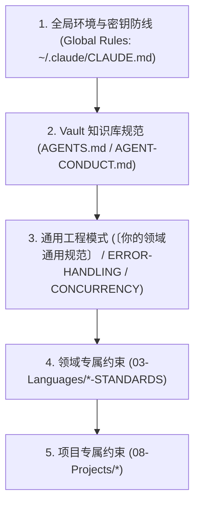

# ⚖️ 规则与工程规范导航索引 (MOC-Rules)

> 本索引汇集知识库内所有跨项目通用的工程准则、Agent 交互契约、Git 工作流与协作机制，构筑全局质量与行为安全底线。

---

> [!TIP] 🎨 架构可视化
> 本模块在全局生命周期中的位置详见 **全景架构画布** 的 `01-Rules` 区域。

---

## 1. 核心通用规则一览

| 规则文档 | 核心关注领域 | 适用受众 | 约束级别 | 状态 |
| :--- | :--- | :--- | :--- | :--- |
| 🤖 AGENT-CONDUCT | Agent 知识库交互守则、Frontmatter 完整性、双版本同步机制、非破坏性编辑 | `agent` | `MUST` | `stable` |
| 🛠️ SKILL-AUTHORING-SPEC | **Agent 技能工程与编写规范**：第一性原理、TDD 驱动、Leading Words 概念锚定、六大失效模式防线 | `both` | `MUST` | `stable` |
| 🖥️ 环境说明 | **本机开发环境拓扑与避坑事实**：网络检索、MSYS2软链接、席皓宇符号链接、WSL2镜像网络、Docker端口 | `agent` | `MUST` | `stable` |
| 🧠 数据规范 | **数据集与语料库洁净度守则**：严禁语义默认兜底桶、分类纯度契约测试、语法模板防幻觉 | `both` | `MUST` | `stable` |
| 📐 〔你的领域通用规范〕 | 通用编码规范（11 大原则）、意图命名、单一职责、Raw Response 缓存、断言自问、替换安全、终端适配 | `both` | `MUST` / `SHOULD` | `stable` |
| 🛡️ GIT-CONVENTIONS | Git 提交规范 (Conventional Commits)、分支策略、密钥防泄露与双层历史审计（可达+悬空） | `both` | `MUST` | `stable` |
| 🔄 领域专题规范 | 错误处理全景矩阵、四项统一铁律、错误包装与重试弹性策略 | `both` | `MUST` / `SHOULD` | `stable` |
| ⚡ 领域专题规范 | 并发控制矩阵、结构化并发、锁作用域最小化与事件循环隔离 | `both` | `MUST` / `SHOULD` | `stable` |
| 🔬 TESTING-PATTERNS | **测试防死测模式**：静态断言出现次数预检、动态探针切源码执行、夹具自洽性（恒假夹具禁令） | `both` | `MUST` | `stable` |
| 🗂️ MARKDOWN-REGISTRY-VALIDATION | **Markdown 注册表/清单机器校验防御**：被程序消费的表格 MUST 配机器闸门、标题深度容错、L1/L2 分层校验（SKIP vs FAIL） | `both` | `MUST` / `SHOULD` | `stable` |
| 📝 MARKDOWN-TABLE-APPEND | **Markdown 表格追加与程序化写操作防御**：追加行 MUST 插表格块末、单一写入器、alias 内 `\|` 陷阱、门禁排除 IDE 目录 | `both` | `MUST` / `SHOULD` | `stable` |
| 🐍 工具链规范 | **Python 打包与模块入口规范**：`__init__.py` 零依赖 re-export、shim 迁移过渡、扁平包结构原则 | `both` | `MUST` | `stable` |
| 📄 DOC-GOVERNANCE | **文档治理与入口拆分**：Deletion Test 适用于文档、入口文件 >100 行 MUST 拆分、防回搬锁 | `both` | `MUST` / `SHOULD` | `stable` |
| 🔍 AGENT-AUDIT-CHECKLIST | **子 Agent 定义审计清单**：6 项检查、工具名对齐、maker 白名单最小化、evidence gate 控制 | `both` | `MUST` | `stable` |

---

## 2. 规则对比与静态检查矩阵 (Rules Comparative Matrix)

| 规范条目 | 核心领域 | 关键原则 (Core Tenets) | RFC 2119 关键约束 | 静态检查 / 验证方法 |
|:---|:---|:---|:---|:---|
| **[[01-Rules/AGENT-CONDUCT]]** | 知识库治理 | 零破坏性编辑、单源真值、元数据完备 | Agent **MUST NOT** 覆写软链接为实体文件；**MUST** 校验 Frontmatter 7 必填项 | `test-symlinks.sh` / YAML Lint / 路径检测 |
| **〔你的领域通用规范〕** | 代码编写基线 | 意图命名、单一职责(YAGNI)、营地规则、断言自问、替换安全、环境适配 | 过滤规则 **MUST NOT** 误杀合法边缘；修改 **MUST NOT** 仅匹配行前缀；断言 **MUST** 自问回退必红；输出 **MUST** 配 UTF-8 | 代码审查 / 单元测试 / 边缘用例覆盖 / 编码检查 |
| **[[01-Rules/GIT-CONVENTIONS]]** | 提交与安全 | 规范提交说明、零密钥泄露、双层历史审计、模式权限匹配 | 提交前 **MUST** 执行 Key 扫描正则；**MUST NOT** 使用 `--no-verify` 跳过守卫；发现泄露 **MUST** 立即轮换 | Pre-commit Hook / `gitleaks` / `git fsck` |
| **ERROR-HANDLING** | 容错与恢复 | 显式处理、完整错误链、指数退避 | **MUST NOT** 静默吞异常；跨层传递 **MUST** 保留 root cause；重试 **MUST** 具备幂等性 | 异常链路追踪测试 / 故障注入测试 |
| **CONCURRENCY** | 并发与异步 | 生命周期受控、通信共享内存、优雅停机 | 创建者 **MUST** 负责销毁 Goroutine/线程；**MUST** 监听 Context Cancel 信号退出 | `-race` 竞态检测 / 泄漏检测 (goleak) |
| **领域专题规范** | 数据库迁移 | 幂等对账、单事务原子、还原补迁移 | 对账谓词方向 **MUST** 匹配数据单调性；迁移 **MUST** 单事务；旧备份还原 **MUST** 补幂等迁移 | 三段时序回归测试（迁移→新写入→重启）/ 行数对账断言 |
| **工具链规范** | Python 打包 | 零依赖 re-export、shim 过渡、扁平包 | `__init__.py` **MUST NOT** 含跨模块 import；shim **MUST** 标记 deprecated | `__init__.py` 静态分析 / 模块导入测试 |
| **[[01-Rules/DOC-GOVERNANCE]]** | 文档治理 | Deletion Test、入口拆分、防回搬锁 | 入口 >100 行 **MUST** 拆分；源笔记 **MUST NOT** 含防御性规范 | 行数检查 / wikilink 完整性验证 |
| **[[01-Rules/AGENT-AUDIT-CHECKLIST]]** | 子 Agent 审计 | 6 项检查清单、工具名对齐、责任边界 | 新增 Agent **MUST** 过审计；maker/checker **MUST** 分离 | 审计清单逐项验证 |

---

## 3. 规范效力与执行层级 (Hierarchy & Precedence)



1. **层级覆盖规则**：下层规范可对上层规范进行特化与补充，但 **MUST NOT** 突破上层定义的安全底线（如 Key 防泄露、单源维护、RFC 2119 约束）。
2. **冲突仲裁**：当语言规范与通用模式发生局部语义冲突时，以具体语言规范（`*-STANDARDS.md`）的最佳实践为准，但必须在 PR / 提交日志中说明权衡考量。
3. **约束级别说明**：
   - `MUST` / `MUST NOT`：绝对约束，违反即视为严重缺陷或构建拦截。
   - `SHOULD` / `SHOULD NOT`：强烈推荐，偏离必须有充分架构理由。
   - `MAY`：可选实现，视具体业务上下文权衡采用。

---

## 4. 动态数据视图 (Dataview Queries)

### 4.1 全库通用规范清单
```dataview
TABLE audience as "受众", status as "状态", updated as "最后更新"
FROM "01-Rules"
SORT file.name ASC
```

### 4.2 包含并发与错误处理主题的笔记
```dataview
TABLE type, audience, status, updated as "更新时间"
FROM ""
WHERE contains(tags, "topic/concurrency") OR contains(tags, "topic/error-handling")
SORT updated DESC
```

---

## 5. 相关导航
- 知识库总览中心：[[00-MOC/Home]]
- 技术栈双版本规范：[[00-MOC/MOC-Languages]]
- AI 工具链与环境：[[00-MOC/MOC-Tools]]
- 规则标准模板：[[Templates/tpl-standards]]
- 审计日志：[[11-Agents/review-log]]
