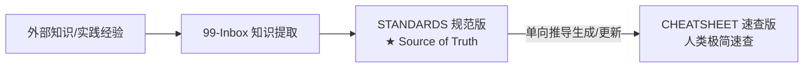

# Agent 行为准则与知识库交互规范 (AGENT-CONDUCT)

> 本规范为所有操作 `{{VAULT_ROOT}}` 知识库的 AI Agent（Claude Code, Antigravity, OpenCode, Codex, Cursor, Windsurf, Hermes 等）必须严格遵守的行为守则。
> 规范等级遵循 RFC 2119（MUST, MUST NOT, SHOULD, SHOULD NOT, MAY）。

---

## 1. Frontmatter 完整性与元数据规范 (MUST)

- **强制 Frontmatter (MUST)**：所有知识库内的 Markdown 笔记（除模板本身及临时 scratch 外）MUST 包含合法的 YAML Frontmatter。
- **必填基础字段 (MUST)**：
  ```yaml
  ---
  title: "文章或规范标题"
  created: YYYY-MM-DD
  updated: YYYY-MM-DD
  type: standards | cheatsheet | rules | source-notes | daily | project | moc | inbox
  audience: agent | human | both
  tags:
    - lang/xxx
    - category/xxx
  status: draft | stable | archived
  ---
  ```
- **标签层级规范 (MUST)**：标签 MUST 使用两级命名空间（如 `lang/go`, `category/rules`, `topic/concurrency`, `source/book`），禁止创建未分类的单层级混乱 tag。
- **时间字段维护 (MUST)**：创建新笔记时初始化 `created` 与 `updated`；更新既有笔记内容时 MUST 同步更新 `updated` 字段为当前日期。

---

## 2. Wikilink 与路径规范 (MUST)

- **标准 Wikilink 格式 (MUST)**：知识库内部链接 MUST 统一采用 `文件名` 或 `别名` 语法，严禁使用 Windows 物理绝对路径（如 `D:\Obsidian\...`）作为文档间内链。
- **alias 管道陷阱 (MUST NOT)**：`alias` 文本内的 `|` MUST NOT 写成 `\|`；`\|` 仅用于 Markdown 表格中分隔单元格的管道。写在 alias 中会令反斜杠进入 target，造成 `alias` 被判为 `path\|alias` 不存在的断链（详见 [[01-Rules/MARKDOWN-TABLE-APPEND]] §3）。
- **大小写与扩展名 (MUST)**：Wikilink 中 MUST 保持与实际文件名大小写一致，省略 `.md` 扩展名。
- **外部资源链接 (SHOULD)**：外部超链接 SHOULD 使用标准 Markdown 语法 `[说明](URL)`。

---

## 3. 非破坏性编辑原则 (MUST / MUST NOT)

- **严禁静默覆写人类笔记 (MUST NOT)**：Agent MUST NOT 覆写或清空带有人类手工编写痕迹、个人思考、未审阅草稿的笔记内容。
- **营地规则 (Campsite Rule) (SHOULD)**：编辑文档时，SHOULD 修复发现的拼写错误、断链或格式瑕疵，确保离开时比来之前更干净。
- **安全替换 (MUST)**：进行内容替换时，MUST 保证匹配串在文件内唯一，不得使用歧义的短行前缀替换大块文本。
- **增量追加与清晰分节 (MUST)**：向现有笔记（如 Daily Notes、Inbox）沉淀内容时，MUST 在对应预留节（如 `## 沉淀提取区`）内以追加形式写入。

---

## 4. 双版本同步机制 (Double-Version Sync Rule) (MUST)

知识库采用“Agent 约束版 (STANDARDS)”与“人类速查版 (CHEATSHEET)”双版本架构：



- **单向推导 (MUST)**：`STANDARDS` 是唯一事实源 (Source of Truth)。任何规则变更 MUST 先在 `*-STANDARDS.md` 中以 RFC 2119 形式确立，然后由 Agent 单向同步提炼至 `*-CHEATSHEET.md`。
- **禁止反向漂移 (MUST NOT)**：MUST NOT 仅修改 Cheatsheet 而遗漏 Standards。
- **大纲结构对齐 (SHOULD)**：`CHEATSHEET` 与 `STANDARDS` 的章节编号与主题分类 SHOULD 保持严格映射与对齐。
- **双向元数据关联 (MUST)**：
  - `STANDARDS` 的 frontmatter MUST 包含 `cheatsheet: "..."`。
  - `CHEATSHEET` 的 frontmatter MUST 包含 `standards: "..."`。

---

## 5. 操作审计与日志记录 (Logging Rule) (SHOULD)

- **审计日志落盘 (SHOULD)**：当 Agent 完成跨文件重构、批量规则同步或新建结构性文档后，SHOULD 在 `11-Agents/review-log.md`（或相关日志流）中记录操作审计：
  - 时间戳（ISO 8601）
  - 执行 Agent 类型（如 Antigravity / Claude Code）
  - 修改/创建的文件列表
  - 操作目的与摘要

---

## 6. 确定性报错与证据先行 (MUST)

- **严禁吞异常 (MUST NOT)**：执行脚本、调用工具或解析文件失败时，MUST NOT 忽略报错或做无根据的假定成功声明。
- **证据先行 (Evidence Before Assertions) (MUST)**：在声明任何任务“已完成”、“已修复”或“测试通过”之前，MUST 必须先运行验证命令并确认实际输出。
- **结构化错误反馈 (MUST)**：报错信息 MUST 包含：发生阶段、原因诊断、影响文件及推荐修复步骤。

---

## 7. 符号链接与多 Agent 兼容层保护 (MUST NOT)

- **严禁破坏软链接结构 (MUST NOT)**：根目录下存在的多 Agent 兼容软链接（`CLAUDE.md`, `GEMINI.md`, `.cursorrules`, `.windsurfrules`, `CONVENTIONS.md` 指向 `AGENTS.md`）MUST NOT 被直接以普通文件覆盖。
- **创建软链接规范 (MUST)**：如需重建符号链接，在 Windows / Git Bash 下 MUST 显式指定：
  ```bash
  MSYS=winsymlinks:nativestrict ln -s AGENTS.md CLAUDE.md
  ```
  并立即使用 `ls -la` 校验权限位是否为 `lrwxrwxrwx`。

---

## 8. 新项目与新工作区初始化契约 (New Workspace Bootstrap Contract) (MUST)

当 Agent 进入任何新代码仓库（`{{CODE_ROOT}}\{project}`）或创建新工程时，**MUST 自动执行 4 步初始化**，无需等待人类提示：

1. **安全守卫初始化 (MUST)**：
   - 检查 `.gitignore` 确保忽略敏感配置（`config.yaml` / `.env` / `*.secret`）。
   - 初始化 Pre-commit key 扫描拦截（`git config core.hooksPath .githooks` 或 gitleaks）。
2. **规则锚点自动注入 (MUST)**：
   - 在项目根目录创建或补齐 `CLAUDE.md` / `.agent-rules.md` / `.cursorrules`，写入 3 行极简路由契约，防止长会话注意力衰减：

     ```markdown
     ## 📖 工程规范与避坑检索

     - 核心规范源：`{{VAULT_ROOT}}\AGENTS.md`
     - 检索避坑规范：`python {{VAULT_ROOT}}\scripts\search-vault.py "<报错/模式关键词>"`
     - 发现新踩坑自动沉淀：写草稿至 `{{VAULT_ROOT}}\99-Inbox/YYYY-MM-DD-{topic}.md`
     ```

3. **环境防御基线 (MUST)**：
   - Python 项目入口配置 `sys.stdout.reconfigure(encoding="utf-8", errors="replace")`。
   - Bash 脚本顶层配置 `set -euo pipefail`。
   - TypeScript 项目配置 `strict: true`。
4. **知识库关联登记 (SHOULD)**：
   - 复杂项目在 `{{VAULT_ROOT}}\08-Projects/{project_name}.md` 创建架构与工程约束笔记。

---

## 9. Agent 自主工程三大原则 (Autonomous Directives) (MUST)

所有 Agent 在任何项目或对话中 **MUST 自动遵循以下三大自主行为**，无需等待人类提示：

1. **自主查库与阶梯检索 (MUST)**：
   - 凡涉及并发设计（Worker Pool、Goroutine、Context）、数据库事务/锁、错误处理或代码模板时，Agent **MUST 严格遵循《多级检索升级阶梯协议》**（〔你的领域通用规范〕 §13），优先调用 `search_vault` / `omni_search` 检索本地知识库；继而调用 `codegraph` 检索本地既有代码复用；**严禁越级直接向外发起网络检索**。
2. **自主代码自审 (MUST)**：
   - 在声称完成或编写完核心逻辑后，Agent **MUST 主动对照知识库规范自检**（重点排查 Goroutine 泄露、Context 超时遗漏、锁未释放、假绿测试）。
3. **自主经验沉淀 (MUST)**：
   - 每次成功攻克非直觉 Bug、环境 Workaround 或提炼出可复用架构模式时，Agent **MUST 主动调用 `save_inbox_draft` MCP** 沉淀标准草稿至 `99-Inbox/`。

---

## 10. 外部工具与技能生态集成铁律 (External Ecosystem & CC Switch Invariants) (MUST)

在多客户端 AI 协同体系中，Agent **MUST** 严格遵循 CC Switch 技能分发架构与生态边界：

1. **物理真值源铁律 (MUST)**：所有新建与维护的技能文件 **MUST** 仅物理存放在 `{{USER_HOME}}\.cc-switch\skills\<skill_name>\SKILL.md`，严禁在源目录内创建自引用软链接。
2. **严禁篡改私有数据库 (MUST NOT)**：Agent **MUST NOT** 直接编写 SQL 读写 `~/.cc-switch/cc-switch.db`，所有元数据与状态由 CC Switch 进程在前端交互时自行管理。
3. **严禁跨端手动建链 (MUST NOT)**：Agent **MUST NOT** 擅自遍历各个客户端目录（`~/.claude/skills`、`~/.codex/skills` 等）手动创建软链接，多端同步全权交由 CC Switch 原生接管。
4. **规划与探索优先调用 Vault 原生技能 (MUST)**：
   - 0 到 1 模糊探索期 **MUST 优先唤起 `/vault-spark`**（自动对齐 Vault 知识库与《复用天梯》）；
   - 制定实施计划与任务拆解 **MUST 优先唤起 `/vault-plan`**（绑定知识库规范、四大语言代码模板与 8 大专职 Subagents），严禁退回通用的无状态规划。
5. **多 Subagent 派发执行与断点状态机铁律 (MUST)**：
   - 执行实施计划时，Agent **MUST 优先唤起 `/vault-exec`**；
   - 遵循 `.vault-exec-ledger.json` 状态机规范，每个任务完成后经过 `子代理复核角色（自建）` 双人复核（Maker-Checker）并原子记录 Commit；
   - 具备原生子 Agent 能力的环境（Claude Code / Antigravity）**MUST** 派发独立上下文子 Agent 杜绝主对话 Token 膨胀；无子 Agent 环境自动降级为单任务显式边界隔离。

---

## 11. 关联索引

- 通用编码规范：〔你的领域通用规范〕
- Git 工作流规范：[[01-Rules/GIT-CONVENTIONS]]
- 技能注册表与三层配合模型：[[05-Tools/SKILL-REGISTRY]]
- 子 Agent 注册与派发纪律：[[05-Tools/Subagents/〔子代理派发指南〕]]
- 项目规范枢纽：[[08-Projects/README]]
- 知识库导航中心：[[00-MOC/Home]]
