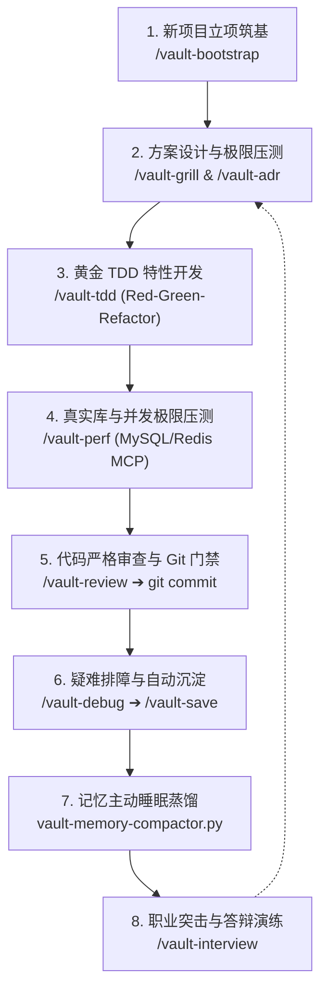

# 🚀 工程全生命周期作业流程与多 Agent 协同 SOP (Master Lifecycle)

> **定位**：定义开发者与多 AI Agent 在软件全生命周期中的标准协同规范。
> **核心哲学**：**人类在前台发号施令并把控方向，AI 在后台自动查库、严密自审、主动排障与持续沉淀。**

---

## 🗺️ 一、全生命周期流转图谱

---

## 📋 二、8 阶段标准作业细则 (SOP)

### 阶段 1：新项目开工与安全筑基 (Inception & Bootstrap)
- **触发命令**：`/vault-bootstrap`
- **人类动作**：进入新代码仓库，输入命令。
- **系统后台全自动**：
  1. 扫描当前工作区语言与环境基线；
  2. 自动生成包含敏感词拦截的 `.gitignore` 与 `.githooks/pre-commit`；
  3. 注入 3 行知识库规范路由锚点（`CLAUDE.md`, `.agent-rules.md`, `.cursorrules`）。
- **交付物**：零泄漏风险、规则自动对齐的合规代码库。

---

### 阶段 2：方案设计与极限压测 (Architecture Design & Grilling)
- **触发命令**：`/vault-grill [初步构想/需求]`
- **人类动作**：抛出初步设计（例如：“*想用 Redis 做分布式任务队列*”）。
- **系统后台全自动**：
  1. Agent 恪守 **Anti-Sycophancy（拒绝盲从）**，主动检索知识库并发规范与历史项目复盘；
  2. 单轮抛出 1~2 个致命边界拷问（死锁、TTL 续期、大 Payload 阻塞）；
  3. 达成共识后，自动调用 `/vault-adr` 生成标准 `ADR-000x` 决策文档。
- **交付物**：经过极限压测的架构方案与正式 ADR。

---

### 阶段 3：TDD 黄金特性开发 (Feature Dev & TDD)
- **触发命令**：`/vault-tdd [功能描述]`
- **人类动作**：指定待实现的功能契约。
- **系统后台全自动**：
  1. 调用 `get_code_template` MCP 提取纯净生产级模板（如 `tpl-http-server.go`）；
  2. **Red Phase**：先写 `*_test.go`，亲眼验证测试变红；
  3. **Green Phase**：编写最短有效实现直至全绿；
  4. 应用**卫语句（Guard Clauses）**与 YAGNI 规则重构多余嵌套。
- **交付物**：100% 测试覆盖、最左对齐的健壮业务代码。

---

### 阶段 4：真实库调优与并发极限压测 (DB Tuning & Profiling)
- **触发命令**：`/vault-perf [热点函数或 SQL]`
- **人类动作**：指定需把关的数据库查询或并发调度逻辑。
- **系统后台全自动**：
  1. 派 **DBA 调优师** 联动 `mysql-dev` MCP 直连本地 MySQL 8.4，执行 `EXPLAIN FORMAT=TREE` 审查最左前缀与覆盖索引；
  2. 派 **并发压测师** 联动 `redis-dev` MCP 实时探针，运行 `go test -bench -benchmem -race`，输出纳秒级耗时报告。
- **交付物**：零竞态风险、低内存分配、索引全覆盖的高性能模块。

---

### 阶段 5：代码审查与物理级 Git 提交 (Review & Gatekeeper Commit)
- **触发命令**：`/vault-review` ➔ `git commit`
- **人类动作**：输入审查命令，确认无误后直接在终端执行 `git commit`。
- **系统后台全自动**：
  1. Agent 依据 5 语言 STANDARDS 逐行严查 Goroutine 退出机制、锁作用域与显式错误链；
  2. Git 底层 Pre-commit Hook 自动运行质量守卫与密钥扫描，**合规秒级放行，违规当场打回**。
- **交付物**：符合生产级规范、Git 历史清晰的干净提交。

---

### 阶段 6：疑难 Bug 系统化排障与自动沉淀 (Debugging & Ingestion)
- **触发命令**：`/vault-debug [报错或异常现象]`
- **人类动作**：提供报错堆栈或异常现象。
- **系统后台全自动**：
  1. 强制禁止盲改代码，先调用 `search_vault` 检索知识库历史避坑记录；
  2. 构造最小复现单测，完成根因根治（RCA）；
  3. 通过 **A-MAC 准入控制**，自动调用 `save_inbox_draft` 将排障复盘存入 `99-Inbox/`。
- **交付物**：根治 Bug 的补丁 + 存入知识库的新经验资产。

---

### 阶段 7：智能体记忆主动睡眠蒸馏 (Memory Compaction)
- **触发命令**：`python scripts/vault-memory-compactor.py`
- **人类动作**：定期在终端运行或由定时任务触发。
- **系统后台全自动**：
  1. 自动聚类 `99-Inbox/` 中累积的碎片；
  2. 多对一深度提炼，合并晋级至 `03-Languages/` 或 `01-Rules/`；
  3. 自动修补双向 Wikilink 反向链接，知识库自我修剪瘦身。
- **交付物**：精炼、稠密、零沉积的个人知识库。

---

### 阶段 8：技术求职与面试高压突击 (Career & Interview Drill)
- **触发命令**：`/vault-interview [专题/项目]`
- **人类动作**：指定考察领域（Go/MySQL/Redis/M1架构），口述作答。
- **系统后台全自动**：
  1. 考官 Agent 从 `09-Career/Exam-Prep/` 抽取高频真题；
  2. 每次只出一道题，等待闭卷作答；
  3. 严格三段式点评：**得分评估 ➔ 扣分点与遗漏机制 ➔ 大厂标准答法示范**。
- **交付物**：肌肉记忆级的底层原理掌握度与高区分度答辩能力。

---

## ⚡ 三、三大不可动摇的工程铁律 (Invariants)

1. **证据先于断言 (Evidence Before Assertions)**：
   - 严禁空口声称“已经修好”或“测试通过”，所有结论必须附带命令执行输出或单测证据。
2. **拒绝无脑迎合 (Anti-Sycophancy)**：
   - AI 发现设计缺陷或重复造轮子时，**必须以理服人率先提出建设性异议**，讲明代价再交还决策权。
3. **离开时更干净 (Campsite Rule & YAGNI)**：
   - 每次代码变动比来之前更好一点；拒绝未经要求的过度提前抽象，优先使用语言标准库。
